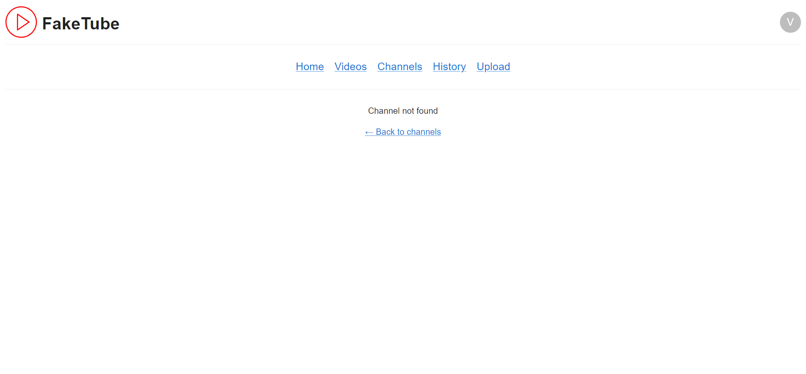

# Channel Page

> When channel id does not correspond to any channel, a default page is rendered

## Mobile

<article>

Success

</article>

<article>

Not found

</article>

## Desktop

<article>

Success

</article>

<article>

Not found

</article>
