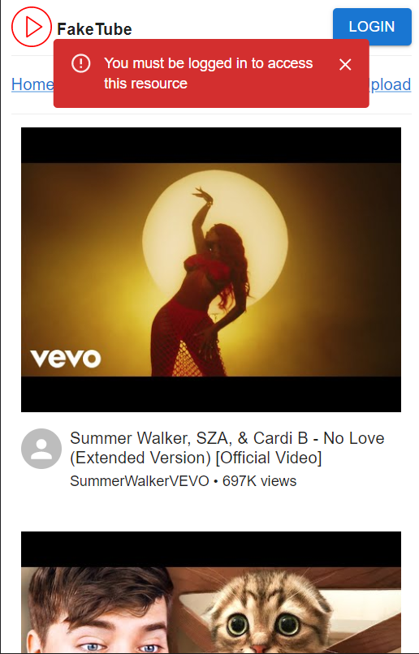

# Channels Page

> When user is not logged in, an error alert pops up and the user is redirected to the home page

## Mobile

<article>

Success

</article>

<article>

Error - Redirect to Home

</article>

## Desktop

<article>

Success

</article>

<article>

Error - Redirect to Home

</article>
