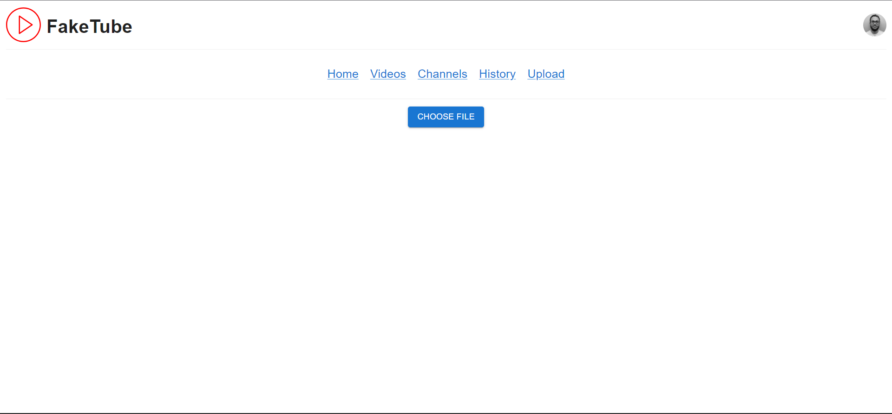
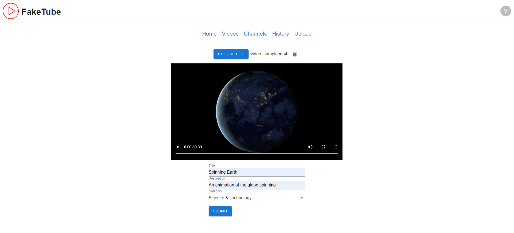

# Upload Page

> When user is not logged in, an error alert pops up and the user is redirected to the home page. See [Channels](./channels.md) to the redirect.

> The current logic does not upload any video thumbnail, so a default (and pretty ugly, if you ask me) thumbnail is assigned by Youtube.

## Mobile

<article>

No video

</article>

<article>

Video

</article>

<article>

Redirect

</article>

## Desktop

<article>

No video

</article>

<article>

Video

</article>

<article>

Redirect

</article>
